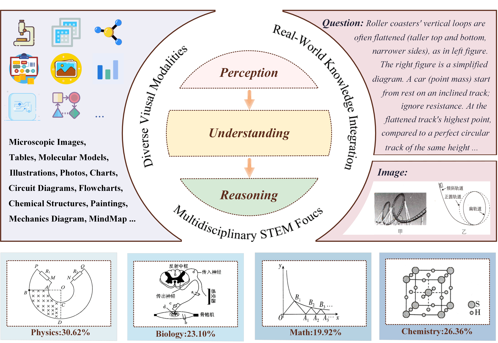

# <div align='center' >CSVQA: A Chinese Multimodal Benchmark for Evaluating Scientific Reasoning Capabilities of VLMs</div>

<div align='center' ></div>

<font size=2><div align='center' >  [[🤗 CSVQA Benchmark](https://huggingface.co/datasets/Skywork/CSVQA)] [[📖 CSVQA Paper](https://example.com/)]</div></font>

Welcome to the CSVQA-Benchmark repository! Here you will find the datasets and evaluation codes for evaluating scientific reasoning capablities of VLMS.

## :bookmark: What is CSVQA?

The Chinese STEM Visual Question Answering (CSVQA) benchmark establishes a rigorous multimodal evaluation framework specifically designed to quantify scientific reasoning capabilities in VLMs. Meanwhile, CSVQA introduces three key challenges that differentiate it from most existing benchmarks. First, its coverage of multiple STEM disciplines requires models to integrate diverse domain knowledge and reasoning strategies. Second, the inclusion of 14 distinct visual modalities introduces significant variation in visual structure and complexity, testing a model’s ability to generalize across image types. Third, many questions are grounded in real-world scenarios and demand domain-specific knowledge, requiring models to go beyond pattern recognition and engage in context-aware, expert-level reasoning.

<div align='center' ></div>

CSVQA contains 1,378 expert-annotated questions with moderate average length, balancing language processing load and reasoning depth. Almost each item is paired with a detailed explanation, which facilitates the assessment of chain-of-thought reasoning and enables interpretable error analysis. This feature is particularly valuable for analyzing logical missteps in model predictions.

## :triangular_flag_on_post: Leaderboard

<!DOCTYPE html>
<html lang="en">
<div align='center'>
<table>
  <thead>
    <tr>
      <th><b>Model</b></th>
      <th><b>Overall</b></th>
      <th><b>Biology</b></th>
      <th><b>Chemistry</b></th>
      <th><b>Math</b></th>
      <th><b>Physics</b></th>
      <th><b>Open</b></th>
      <th><b>MC</b></th>
    </tr>
  </thead>
  <tbody>
    <tr>
      <td>Random Choice</td>
      <td>5.2</td>
      <td>5.1</td>
      <td>6.2</td>
      <td>4.5</td>
      <td>5.7</td>
      <td>0</td>
      <td>5.7</td>
    </tr>
    <tr>
      <td colspan="8"><b>Open-source VLM</b></td>
    </tr>
    <tr>
      <td>Fuyu-8B</td>
      <td>4.9</td>
      <td>6.3</td>
      <td>5.6</td>
      <td>3.5</td>
      <td>4.3</td>
      <td>2.0</td>
      <td>5.1</td>
    </tr>
    <tr>
      <td>Deepseek-VL2</td>
      <td>6.2</td>
      <td>7.0</td>
      <td>6.2</td>
      <td>7.6</td>
      <td>4.5</td>
      <td>8.0</td>
      <td>6.0</td>
    </tr>
    <tr>
      <td>LLaVA1.5-13B</td>
      <td>7.5</td>
      <td>10.7</td>
      <td>9.4</td>
      <td>5.4</td>
      <td>5.5</td>
      <td>4.0</td>
      <td>7.8</td>
    </tr>
    <tr>
      <td>MonoInternVL</td>
      <td>9.3</td>
      <td>7.3</td>
      <td>9.1</td>
      <td>9.2</td>
      <td>10.9</td>
      <td>3.0</td>
      <td>9.8</td>
    </tr>
    <tr>
      <td>Idefics3-8B</td>
      <td>10.1</td>
      <td>11.7</td>
      <td>15.2</td>
      <td>7.0</td>
      <td>7.1</td>
      <td>4.0</td>
      <td>10.6</td>
    </tr>
    <tr>
      <td>Pixtral-12B</td>
      <td>10.5</td>
      <td>15.3</td>
      <td>8.8</td>
      <td>8.6</td>
      <td>10.0</td>
      <td>5.0</td>
      <td>10.9</td>
    </tr>
    <tr>
      <td>Phi-4</td>
      <td>11.5</td>
      <td>13.3</td>
      <td>16.1</td>
      <td>8.9</td>
      <td>8.3</td>
      <td>7.0</td>
      <td>11.8</td>
    </tr>
    <tr>
      <td>Gemma3-27B</td>
      <td>22.9</td>
      <td>26.0</td>
      <td>23.5</td>
      <td>27.0</td>
      <td>17.1</td>
      <td>23.0</td>
      <td>22.9</td>
    </tr>
    <tr>
      <td>InternVL2.5-78B</td>
      <td>28.4</td>
      <td>36.3</td>
      <td>36.1</td>
      <td>24.1</td>
      <td>19.7</td>
      <td>16.0</td>
      <td>29.3</td>
    </tr>
    <tr>
      <td>QVQ-72B</td>
      <td>36.6</td>
      <td>40.7</td>
      <td>41.3</td>
      <td>33.7</td>
      <td>32.0</td>
      <td>32.0</td>
      <td>36.9</td>
    </tr>
    <tr>
      <td>InternVL3-78B</td>
      <td>37.4</td>
      <td><b>46.0</b></td>
      <td>41.1</td>
      <td>36.5</td>
      <td>28.9</td>
      <td>30.0</td>
      <td>38.0</td>
    </tr>
    <tr>
      <td>Qwen2.5-VL-72B</td>
      <td>38.5</td>
      <td>45.7</td>
      <td>40.8</td>
      <td>37.5</td>
      <td>32.2</td>
      <td>29.0</td>
      <td>39.2</td>
    </tr>
    <tr>
      <td colspan="8"><b>Closed-source VLM</b></td>
    </tr>
    <tr>
      <td>GPT-4o</td>
      <td>23.6</td>
      <td>28.0</td>
      <td>23.5</td>
      <td>23.5</td>
      <td>20.6</td>
      <td>18.0</td>
      <td>24.0</td>
    </tr>
    <tr>
      <td>Claude3.7</td>
      <td>36.6</td>
      <td>41.7</td>
      <td>38.1</td>
      <td>37.1</td>
      <td>31.3</td>
      <td>32.0</td>
      <td>36.9</td>
    </tr>
    <tr>
      <td>Gemini2.0-flash</td>
      <td><b>44.1</b></td>
      <td>45.0</td>
      <td><b>45.5</b></td>
      <td><b>47.6</b></td>
      <td><b>39.8</b></td>
      <td><b>46.0</b></td>
      <td><b>44.0</b></td>
    </tr>
    <tr>
      <td>o1</td>
      <td><b>49.6</b></td>
      <td><b>46.2</b></td>
      <td><b>45.1</b></td>
      <td><b>59.0</b></td>
      <td><b>49.1</b></td>
      <td><b>41.3</b></td>
      <td><b>50.2</b></td>
    </tr>
  </tbody>
</table>
</div>
</html>


## :straight_ruler: How to eval the CSVQA Benchmark

### 1. Data Process 

#### 1.1 download the original tsv format file from the official website [CSVQA](https://github.com/csvqa-benchmark/CSVQA/blob/main/data/csvqa_data.tsv)

After you download the csvqa tsv file(which include the Chinese version and the English version), you can put it into the folder `./data`. And the data structure would be like this:

```shell
|--data
|---csvqa_data.tsv
```

#### 1.2 process the tsv file

You can run the following command to process the tsv file:

```bash
cd utils
python tsv_to_jsonl.py --data_dir 'path to csvqa tsv file' --image_dir 'path to save the csvqa images' --is_direct 0
```

* is_direct: This parameter is used to create data that force model to directly answer the question without thinking process. And the output jsonl file names will have a placeholder with `direct`.

After you run the command below, you will get the jsonl files in the folder `--data_dir` and images in the folder `--image_dir` like this:

```shell
|--data_dir
# for normal jsonl file
|----csvqa_data_en.jsonl
|----csvqa_data_zh.jsonl
# for direct jsonl file
|----csvqa_data_en_direct.jsonl
|----csvqa_data_zh_direct.jsonl

|--image_dir
|----Biology_14.jpg
|----Biology_20.jpg
.........
```

#### 1.3 Modify the config.py

Change the `input_files` and `input_files_direct` in `config.py`

* Note: The `config.py` file will be in the `utils` folder and `evaluation` folder.

```python
# 0 for Chinese version, 1 for English version
input_files = {
    0: 'path to the normal Chinese version csvqa jsonl file',
    1: 'path to the normal English version csvqa jsonl file',
}

input_files_direct = {
    0: 'path to the direct format Chinese version csvqa jsonl file',
    1: 'path to the direct format English version csvqa jsonl file',
}
```

#### 1.4 Generate captions

Here we provide the code to generate the caption of each image with the help of the local mllm models, such as InternVl3_78B, Qwen2.5_VL_72B_Instruct and so on. To accelerate the generation speed, we use the `vllm` to load the mllm models.
The following is the generation script.

```bash
cd utils
python generate_caption.py --model_name 'the model name to generate the caption' --max_new_tokens 'the max tokens for generating the captions'
```

* `model_name`: you should add model_name and model_path in the `config.py` before you run this script.
* the generated captions will be saved in the same folder of the generated jsonl files in [1.2](#12-process-the-tsv-files), with the subfolder name `captions`

After you run the command, you can put the `captions` dir(/{path_to_tsv-file}/captions) into `evaluation/config.py` file, with the parameter `caption_dir`.  

### 2. Evaluation

To accelerate the evaluation step, we use the `vllm` to load the mllm models and introduce the `batch inference`.

#### 2.1 Prepare the models

We provide an evaluation shell to evaluate several models on our CSVQA benchmark and you can find the shell in `./eval_shell`.
Then you can refer to `config.py` to download the models and get the `chat_template`.

##### 2.1.1 For models

```python
# in evaluation/config.py
model_name_to_path = {
    'internvl2_5_8b': 'path to InternVL2_5-8B',
    'internvl2_5_26b': 'path to InternVL2_5-26B',
    'internvl2_5_38b': 'path to InternVL2_5-38B',
    ....
}
```

##### 2.1.2 For chat_template

There are two ways to get the chat_template:

* Check the Official HuggingFace Repo of the model you want to evalute.
* Find the chat_template in the [vllm repo](https://github.com/vllm-project/vllm/blob/main/examples/offline_inference/vision_language.py).

After you get the chat_template, you should put the `system_prompt` in `system_prompts` of `config.json` and `chat_template` in `model_name_to_template` of `config.json` seperately.

```python
# in evaluation/config.py
system_prompts = {
    'internvl2_5_8b': '你是由上海人工智能实验室联合商汤科技开发的书生多模态大模型，英文名叫InternVL, 是一个有用无害的人工智能助手。',
    'internvl2_5_26b': '你是由上海人工智能实验室联合商汤科技开发的书生多模态大模型，英文名叫InternVL, 是一个有用无害的人工智能助手。',
    .....
}

model_name_to_template = {
    'internvl2_5_8b': '<|im_start|>system\nsys_prompt<|im_end|>\n<|im_start|>user\n<|text|><|im_end|>\n<|im_start|>assistant\n',
    'internvl2_5_26b': '<|im_start|>system\nsys_prompt<|im_end|>\n<|im_start|>user\n<|text|><|im_end|>\n<|im_start|>assistant\n',
    .....
}
```

#### 2.2 Evaluate open-source models on CSVQA benchmark

Run the following command to evaluate the open-source models on CSVQA benchmark:

```bash
cd evaluation
model_name="model_name"
# for visual + question
python eval.py --model_name $model_name --is_en 0 --q_type 0 --output_dir 'path to save the evaluation results' --batch_size 128 --max_new_tokens 8192 --is_drect 0
# the output_dir will be {output_dir}/{max_new_tokens}/v_q/zh/{model_name}

# for pure question
python eval.py --model_name $model_name --is_en 0 --q_type 1 --output_dir 'path to save the evaluation results' --batch_size 128 --max_new_tokens 8192 --is_direct 0
# the output_dir will be {output_dir}/{max_new_tokens}/q/zh/{model_name}

# for caption + question
python eval.py --model_name $model_name --is_en 0 --q_type 2 --output_dir 'path to save the evaluation results' --batch_size 128 --max_new_tokens 8192 --caption_model 'qwen2_5_vl_72b_instruct' --caption_length 4096 --is_direct 0
# the output_dir will be {output_dir}/{max_new_tokens}/c_q/{caption_model}/{caption_length}/zh/{model_name}
```

* `is_en` is language selection paramter:
    * `0`: represents the Chinese version.
    * `1`: represents the English version.
* `q_type` is a question type paramter:
    * `0`: represents the original question type.(v + q, Vision + Question)
    * `1`: represents the question type which only contains the question.(q, Question only)
    * `2`: represents the question type which contains the vision caption and the question.(c + q, Caption + Question). Before using this question type, you should run the `generate_caption.py` in [1.4](#14-generate-captions) to generate the captions of each image.
* `caption_model` is the model used to generate the caption of each image.
* `caption_length` is the max new tokens in the caption generation phase.
* `is_direct` is a flag to indicate whether the input is direct format or not.
    * 0: use the normal jsonl file for evaluation
    * 1: use the direct jsonl file for evaluation, and the `output_dir` will be `output_dir_direct`

#### 2.3 Evaluate proprietary models on CSVQA benchmark

Run the following command to evaluate the proprietary models on CSVQA benchmark:

```bash
cd evaluation
model_name="model_name"
# for visual + question
python eval.py --model_name $model_name --is_en 0 --q_type 0 --output_dir 'path to save the evaluation results' --batch_size 128 --max_new_tokens 8192 --is_drect 0
# the output_dir will be {output_dir}/{max_new_tokens}/v_q/zh/{model_name}

# for pure question
python eval.py --model_name $model_name --is_en 0 --q_type 1 --output_dir 'path to save the evaluation results' --batch_size 128 --max_new_tokens 8192 --is_direct 0
# the output_dir will be {output_dir}/{max_new_tokens}/q/zh/{model_name}

# for caption + question
python eval.py --model_name $model_name --is_en 0 --q_type 2 --output_dir 'path to save the evaluation results' --batch_size 128 --max_new_tokens 8192 --caption_model 'qwen2_5_vl_72b_instruct' --caption_length 4096 --is_direct 0
# the output_dir will be {output_dir}/{max_new_tokens}/c_q/{caption_model}/{caption_length}/zh/{model_name}
```

| The paramaters are the same as in [2.2](#22-evaluation-models-on-csvqa-benchmark).

### 3. Analysis

#### 3.1 Prepare the evaluation open-source models

Add the model_name and model_path to the `config.py` file in `analysis` folder.

#### 3.2 Analysis the evaluation results

(Transformers Version): You can run the following command to analysis the evaluation results:

```bash
cd analysis
python analysis.py --input_dir 'path to the evaluation results' --output_dir 'path to save the analysis results' --model_name 'the model to judge the open question' --q_type 0 --max_new_tokens 8192 --caption_model 'qwen2_5_vl_72b_instruct' --caption_length 4096 --mum
```

* `input_dir` is the path to the evaluation results, which is equal to the `output_dir` in the `eval.py` in [2.2](#22-evaluation-models-on-csvqa-benchmark).
* `model_name` is the model to judge the open question, you can put the model_name and model_path to the `config.json` file.
* `q_type` is the question type.
* `max_new_tokens` is the max new tokens in the [2.2](#22-evaluation-models-on-csvqa-benchmark).
* `caption_model` is the model used to generate the caption. This parameter is activated when `q_type` is `2`.
* `caption_length` is the max new tokens in generating the caption. This parameter is activated when `q_type` is `2`.
* `mum` is used to decide whether to use llm model to judge the multiple-choice question when \boxed{} can not be detected.
    * If use this parameter, the llm model will be used in judge the multiple-choice question.

(VLLM Version, faster): You can run the following command to analysis the evaluation results:

```bash
cd analysis
python analysis_vllm.py --input_dir 'path to the evaluation results' --output_dir 'path to save the analysis results' --model_name 'the model to judge the open question' --q_type 0 --max_new_tokens 8192 --caption_model 'qwen2_5_vl_72b_instruct' --caption_length 4096 --mum
```

| The parameters are same as the transformers version.

#### 3.3 Summary the analysis results(optional)

You can run the following command to summary the analysis results and it will generate the summary files in `xlsx` file:

```bash
cd analysis
python summary.py --input_dir 'path to the analysis results' --output_dir 'path to save the summary results' --model_name 'the model to judge the open question'
```

* `input_dir` is the path to the analysis results, which is equal to the `output_dir` in the `analysis.py` in [3.1](#31-analysis-the-evaluation-results)
* `model_name` is the model name to judge the open question in [3.1](#31-analysis-the-evaluation-results)

After you run the command, you will get the summary results in the folder `--output_dir` like this:

```shell
|--output_dir
|----max_new_tokens
|------model_name
|--------v_q
|----------en
|------------summary_en.xlsx
|----------zh
|------------summary_zh.xlsx
|--------q
|----------en
|------------summary_en.xlsx
|----------zh
|------------summary_zh.xlsx
|--------c_q
|----------caption_model_1
|------------caption_length
|--------------en
|----------------summary_en.xlsx
|--------------zh
|----------------summary_zh.xlsx
|----------caption_model_2
........
```


## :bookmark_tabs: Citation

 If you find our benchmark useful in your research, please consider citing this BibTex: 

```
@misc{jian2025csvqachinesemultimodalbenchmark,
      title={CSVQA: A Chinese Multimodal Benchmark for Evaluating STEM Reasoning Capabilities of VLMs}, 
      author={Ai Jian and Weijie Qiu and Xiaokun Wang and Peiyu Wang and Yunzhuo Hao and Jiangbo Pei and Yichen Wei and Yi Peng and Xuchen Song},
      year={2025},
      eprint={2505.24120},
      archivePrefix={arXiv},
      primaryClass={cs.CV},
      url={https://arxiv.org/abs/2505.24120}, 
}
```
